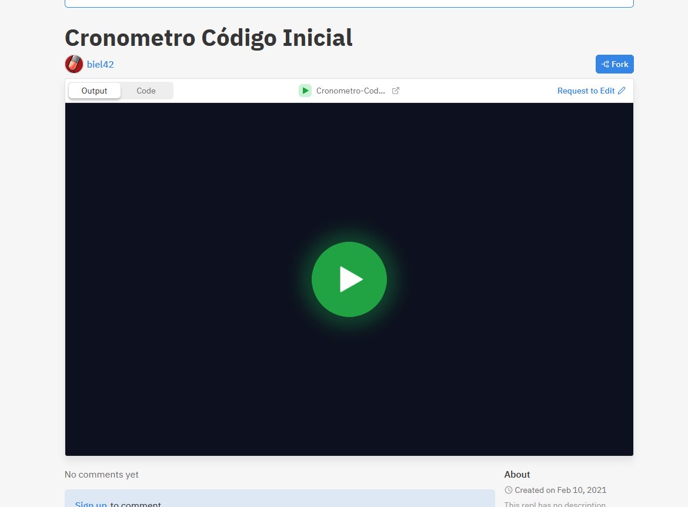
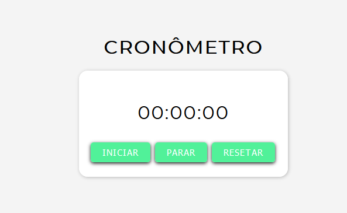
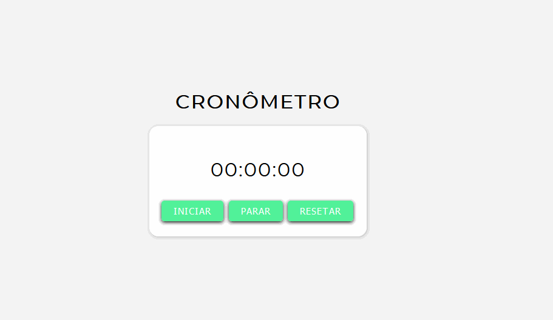

<center>Construa um cronômetro simples com HTML, CSS & JavaScript</center>  
<center>Feito por <a href="https://github.com/faisalsayed10" target="_blank">@faisalsayed10</a></center>
<center>Traduzido por <a href="https://github.com/gabriellimma" target="_blank">@gabriellimma</a></center>

<br />

Aposto que você já usou um cronômetro muitas vezes, seja para corridas ou apenas para se divertir! Você já se perguntou como seria legal se construíssemos nosso próprio cronômetro? Bem, hoje, vamos construir juntos um cronômetro simples e bonito!

<a href="https://cronometro.biel42.repl.co/" target="_blank">

</a>

Aqui está o [código fonte](https://repl.it/@biel42/cronometro#index.html) e a [demonstração ao vivo](https://cronometro.biel42.repl.co/).

## Parte 1:  Pré-requisitos

Você deve ter um conhecimento básico de:

- HTML
- CSS
- JavaScript

## Parte 2: Configuração

### Configurando seu ambiente de código no Repl.it

O [Repl.it](https://repl.it) é um editor de código online. Você não precisa usar o Repl.it, mas sugiro que use, uma vez que ele configura tudo para você e não é necessário instalar nada.

Além disso, preparei um código inicial para que você possa começar. Basta ir [aqui](https://repl.it/@biel42/Cronometro-Codigo-Inicial) e seu ambiente de de desenvolvimento irá iniciar em segundos ;)!

Você deve ver algo como parecido com isto:



Clique no botão **FORK** na parte superior para começar a editar!

## Parte 3: Construindo o projeto

### 1) Código inicial

Vamos primeiro dar uma olhada em nosso código inicial. Em nosso arquivo `index.html`, temos um `container` div e uma tag `<h1>` dentro dele.

Em seguida, se dermos uma olhada em nosso arquivo `style.css`, todos os estilos estão pré-escritos para você! Mas se você quiser mudar qualquer estilo, sinta-se à vontade!

### 2) HTML

Precisamos adicionar mais algumas linhas HTML para construir nosso cronômetro. Escreveremos todo nosso código HTML dentro da div `container`. Defina uma tag `<div>` com uma classe `principal` abaixo da tag `<h1>`.

```html
<h1>CRONÔMETRO</h1>
<div class="principal"></div>
```

Dentro da div `principal`, adicionaremos uma tag `<p>` com uma classe de `tempo` e tags separadas `<span>` para minutos, segundos e milissegundos, respectivamente. Confuso?  Dá uma olhada no código abaixo:

```html
<p class="tempo">
  <span class="minutos">00</span>:<span class="segundos">00</span>:<span class="milissegundos">00</span>
</p>
```

Se você clicar **RUN**, verá que construímos um layout básico do nosso cronômetro!


Agora, acrescentaremos alguns botões para o funcionamento de nosso cronômetro. Crie uma tag `<div>` abaixo da nossa tag `<p>` e adicione 3 botões dentro dela com o texto e a classe de `iniciar`, `parar` e `resetar` respectivamente.

```html
<div>
  <button class="iniciar">INICIAR</button>
  <button class="parar">PARAR</button>
  <button class="resetar">RESETAR</button>
</div>
```


Este é nosso código até agora:

```html
<body>
  <div class="container">
    <h1>CRONÔMETRO</h1>
    <div class="principal">
      <p class="tempo">
        <span class="minutos">00</span>:<span class="segundos">00</span>:<span class="milissegundos">00</span>
      </p>
      <div>
        <button class="iniciar">INICIAR</button>
        <button class="parar">PARAR</button>
        <button class="resetar">RESETAR</button>
      </div>
    </div>
  </div>
  <script src="script.js"></script>
</body>
```


E isto é o que você verá quando clicar em **RUN**.



Aqui está uma curiosidade engraçada: Você acabou de terminar de escrever o HTML!

Como o arquivo `style.css` foi pré-escrito para você, agora vamos diretamente para o JavaScript.

## 3) JavaScript

Navegue até seu arquivo `script.js` e vamos começar a escrever JavaScript!

Primeiro vamos ligar os milissegundos, segundos e minutos em nosso HTML com algumas variáveis.

```js
const miliseg = document.querySelector('.milissegundos')
const seg = document.querySelector('.segundos')
const min = document.querySelector('.minutos')
```

Explicação: Definimos 3 variáveis `miliseg`, `seg` e `min` utilizando `const` e definimos seu valor para o primeiro elemento que corresponde a uma classe(s) CSS especificada(s) no documento. Em nosso caso, esses seletores de CSS são `.milissegundos` , `.segundos` , `.minutos` respectivamente.

Agora, se você está se perguntando o que é um `const` e o que é um `querySelector()`, deixe-me esclarecer todas as suas dúvidas!

Principalmente, existem 3 maneiras de definir uma variável em JavaScript.

1. `var`
2. `let`.
3. `const`.

Vamos ignorar o `var` por enquanto, pois não vamos utilizá-lo. Se definirmos uma variável utilizando `let`, então poderemos alterar seu valor a qualquer momento no código. Entretanto, o valor de uma `const` ("constante") sempre permanece constante e não pode ser alterado - se você tentar alterá-la, o JavaScript mostrará um erro no console.

**O que é querySelector()?** O método `querySelector()` retorna o primeiro elemento que corresponde a uma classe(s) CSS especificada(s) no documento.

Saiba mais sobre [query selector](https://developer.mozilla.org/pt-BR/docs/Web/API/Document/querySelector).  
Saiba mais sobre os [tipos de variáveis (inglês)](https://www.freecodecamp.org/news/var-let-and-const-whats-the-difference/).

Agora, vamos definir mais 4 variáveis, mas desta vez, utilizando `let`.

```js
let miliNum = 0
let segNum = 0
let minNum = 0
let INTERVALO
```

Explicação: Vamos incrementar as variáveis `miliNum`, `segNum` e `minNum` e exibi-las na tela quando o usuário iniciar o cronômetro. A variável `INTERVALO` será utilizada para limpar ou definir os intervalos.

A seguir, definiremos algumas funções para incrementar milissegundos, segundos e minutos cada uma e as adicionaremos ao nosso HTML.

```js
function milissegundos() {
  miliNum++
  miliseg.innerHTML = miliNum
}

function segundos() {
  segNum++
  seg.innerHTML = segNum
}

function minutos() {
  minNum++
  min.innerHTML = minNum
}
```

Agora, as funções abaixo serão chamadas quando alguém aperta o botão INICIAR. Para isso, criaremos também uma função `iniciar()`.

```js
function iniciar() {
  clearInterval(INTERVALO)
  INTERVALO = setInterval(() => {
    milissegundos()
  }, 10)
}
```

Explicação: Na função `iniciar()`, podemos utilizar as propriedades `setInterval` e `clearInterval` para o funcionamento de nosso cronômetro. Mas antes de mais nada, limparemos todos os intervalos, se houver, antes de estabelecer um novo intervalo. Definimos a variável `INTERVALO` pra isso.

Após limparmos todos os intervalos anteriores, definimos um novo intervalo de 0,010 segundos e chamaremos a função `milissegundos()` a cada 0,010 segundos.

**NOTA:** 0,010 segundos = 1 milissegundo

Agora, a sintaxe da função "SetInterval" parece um pouco estranha, certo? Vamos entendê-la.

```js
setInterval(funcao, intervaloDeTempo)
```

O `setInterval` pega uma função e um tempo de intervalo em segundos. Ele chamará a função repetidamente após o `intervaloDeTempo` em segundos. Assim, utilizando essa sintaxe, passamos uma função de seta (=>) que chama a função `milissegundos()` a cada 1 milissegundo.

Aprenda mais sobre [`setInterval() (em inglês)`](https://www.w3schools.com/js/js_timing.asp).

Seu código até agora:

```js
const miliseg = document.querySelector('.milissegundos')
const seg = document.querySelector('.segundos')
const min = document.querySelector('.minutos')

let miliNum = 0
let segNum = 0
let minNum = 0
let INTERVALO

function milissegundos() {
  miliNum++
  miliseg.innerHTML = miliNum
}

function segundos() {
  segNum++
  seg.innerHTML = segNum
}

function minutos() {
  minNum++
  min.innerHTML = minNum
}

function iniciar() {
  clearInterval(INTERVALO)
  INTERVALO = setInterval(() => {
    milissegundos()
  }, 10)
}
```

Agora se você clicar em **RUN** e depois se pressionar o botão `INICIAR`, nada acontece porque não chamamos essa função.

Para isso, voltaremos ao nosso arquivo `index.html`. Adicionaremos um atributo `onclick` a nossos botões para chamar nossas funções.

```html
<button onclick="iniciar()" class="iniciar">INICIAR</button>
<button onclick="parar()" class="parar">PARAR</button>
<button onclick="resetar()" class="resetar">RESETAR</button>
```

Explicação: Embora não tenhamos definido a função `parar()` e a função `resetar()`, ainda assim vamos adicioná-las ao `onclick` e as definiremos mais tarde.

Agora, sempre que alguém clicar no botão (iniciar), a função `iniciar()`será chamada!

Vamos voltar ao nosso arquivo JavaScript e testá-lo!


Hmm... Funciona, mas não como esperado. Existem 2 falhas.

1. Se você olhar de perto, não aparece como '01' '02' etc., mas aparece como '1' '2' etc. e isso é muito ruim.
2. Os milissegundos continuam aumentando e mesmo acima de 100, mas os segundos nunca aumentam.

Bora consertar?

Dentro da nossa função `milissegundos()`, vamos escrever algumas declarações `if-else`. Assim, se os milissegundos forem inferiores a 10, acrescentaremos um 0 e se os milissegundos forem iguais a 99, colocaremos os milissegundos em 0 novamente e chamaremos a função `segundos()`.

Sua função `milissegundos()` ficará assim:

```js
function milissegundos() {
  miliNum++
  if (miliNum < 10) {
    miliseg.innerHTML = '0' + miliNum
  } else {
    miliseg.innerHTML = miliNum
  }

  if (miliNum == 99) {
    miliNum = 0
    segundos()
  }
}
```

Da mesma forma, faremos isso durante os segundos e minutos também!

**Desafio:** Tente implementar as declarações `if-else` dentro da função `segundos()` e `minutos()`.  
**Dicas:**

1. Os segundos não devem exceder 60 e devem chamar a função `minutos()`.
2. Os minutos não precisam ser verificados se excedem ou não porque as horas estão ausentes em nosso cronômetro.

SPOILER: Resposta abaixo!

```js
function milissegundos() {
  miliNum++
  if (miliNum < 10) {
    miliseg.innerHTML = '0' + miliNum
  } else {
    miliseg.innerHTML = miliNum
  }

  if (miliNum == 99) {
    miliNum = 0
    segundos()
  }
}

function segundos() {
  segNum++
  if (segNum < 10) {
    seg.innerHTML = '0' + segNum
  } else {
    seg.innerHTML = segNum
  }

  if (segNum == 59) {
    segNum = 0
    minutos()
  }
}

function minutos() {
  minNum++
  if (minNum < 10) {
    min.innerHTML = '0' + minNum
  } else {
    min.innerHTML = minNum
  }
}
```

Agora de **RUN** no projeto, clique no botão INICIAR e voilà! 

Agora, temos apenas 2 últimas funções para implementar e estamos prontos! Elas são a função `parar()` e a função `resetar()`.

A função `parar()` é praticamente um código de uma linha. Você pode escrevê-la de duas maneiras diferentes, como quiser.

Seja desta maneira:

```js
function parar() {
  clearInterval(INTERVALO)
}
```

Ou:

```js
const stop = () => clearInterval(INTERVALO)
```

Só temos que "limpar o intervalo" e nosso cronômetro vai parar! Também as duas funções funcionam exatamente da mesma maneira!

**NOTA:** Escreva apenas 1 das 2 funções acima.

Para reiniciar o cronômetro, implementaremos a função `resetar()` que será assim:

1. Limpar todos os intervalos.
2. Defina todas as variáveis para 0.
3. Defina o `innerHTML` para "00".

```js
function resetar() {
  clearInterval(INTERVALO)
  miliNum = 0
  segNum = 0
  minNum = 0
  miliseg.innerHTML = '00'
  seg.innerHTML = '00'
  min.innerHTML = '00'
}
```

Depois que terminarmos de implementar estas 2 funções, tenho o prazer de dizer que você completou o desenvolvimento do cronômetro!


Aqui está o código final do JavaScript:

```js
const miliseg = document.querySelector('.milissegundos')
const seg = document.querySelector('.segundos')
const min = document.querySelector('.minutos')

let miliNum = 0
let segNum = 0
let minNum = 0
let INTERVALO

function milissegundos() {
  miliNum++
  if (miliNum < 10) {
    miliseg.innerHTML = '0' + miliNum
  } else {
    miliseg.innerHTML = miliNum
  }

  if (miliNum == 99) {
    miliNum = 0
    segundos()
  }
}

function segundos() {
  segNum++
  if (segNum < 10) {
    seg.innerHTML = '0' + segNum
  } else {
    seg.innerHTML = segNum
  }

  if (segNum == 59) {
    segNum = 0
    minutos()
  }
}

function minutos() {
  minNum++
  if (minNum < 10) {
    min.innerHTML = '0' + minNum
  } else {
    min.innerHTML = minNum
  }
}

function iniciar() {
  clearInterval(INTERVALO)
  INTERVALO = setInterval(() => {
    milissegundos()
  }, 10)
}

function parar() {
  clearInterval(INTERVALO)
}

function resetar() {
  clearInterval(INTERVALO)
  miliNum = 0
  segNum = 0
  minNum = 0
  miliseg.innerHTML = '00'
  seg.innerHTML = '00'
  min.innerHTML = '00'
}
```

Aqui está o projeto finalizado:



## Parte 4: Final

Se você ainda não criou uma conta no repl.it, faz lá, rapidão para salvar essa maravilhosa peça de arte que você acabou de criar!

Aqui estão algumas coisas que você pode fazer:

1. Tente acrescentar horas em nosso cronômetro.
2. Tente mudar o botão INICIAR para exibir RESUMIR/VOLTAR sempre que alguém clicar em PARAR.
3. Faça os milissegundos como 3 dígitos em vez de 2!
4. Tente adicionar voltas em nosso cronômetro que serão exibidas quando alguém clicar em PARAR.

Aqui estão mais alguns exemplos para você:

1. [Cronômetro com horas](https://repl.it/@FaisalSayed1/Stopwatch-with-hours).
2. [Cronômetro com 3 dígitos milissegundos](https://repl.it/@FaisalSayed1/Stopwatch-with-3-digit-milliseconds).
3. [Cronômetro com botão de INICIAR dinâmico](https://repl.it/@FaisalSayed1/Stopwatch-with-dynamic-start-button).

Construído por Hack Clubbers:

1. [Adrian](https://stopwatch.loboadrian.repl.co/)
2. [Tanishq](https://rundowncompassionatepassword.tanishqsoni.repl.co/)
3. [Eric Zhu](https://frivolousshimmeringblock.ericzhu7.repl.co/)

Agora que você terminou de construir este maravilhoso projeto, compartilhe sua bela criação com outras pessoas! Lembre-se, é só mandar a URL do seu projeto!

Você provavelmente conhece as melhores maneiras de entrar em contato com seus amigos e familiares, mas se você quiser compartilhar seu projeto com a comunidade brasileira do Hack Club, não há melhor lugar para fazer isso do que no Discord do Hack Club Brasil.✨

1. Clique [aqui][discord]{:target="_blank"} para fazer parte da nossa comunidade!
2. Depois, poste o link do seu projeto no canal `💡┇criações` para compartilhá-lo com todos os Hack Clubbers!

A comunidade te espera!🎉🎉

[discord]: http://bit.ly/discord-hc-brasil
