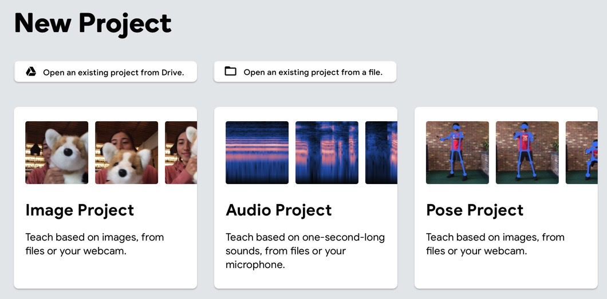
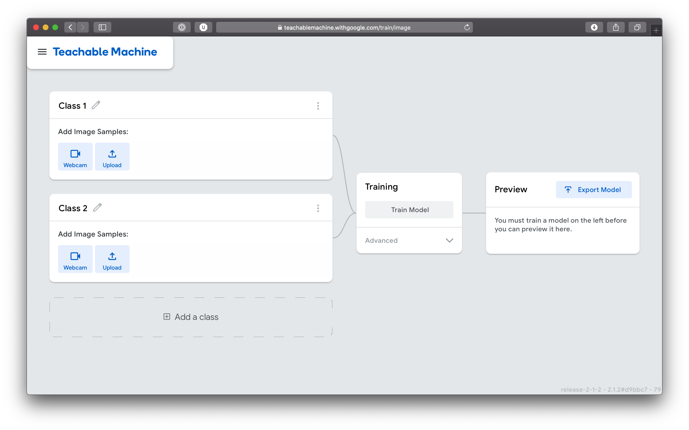
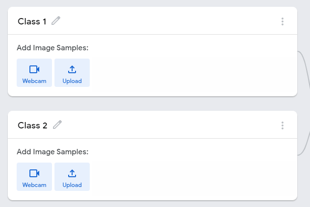
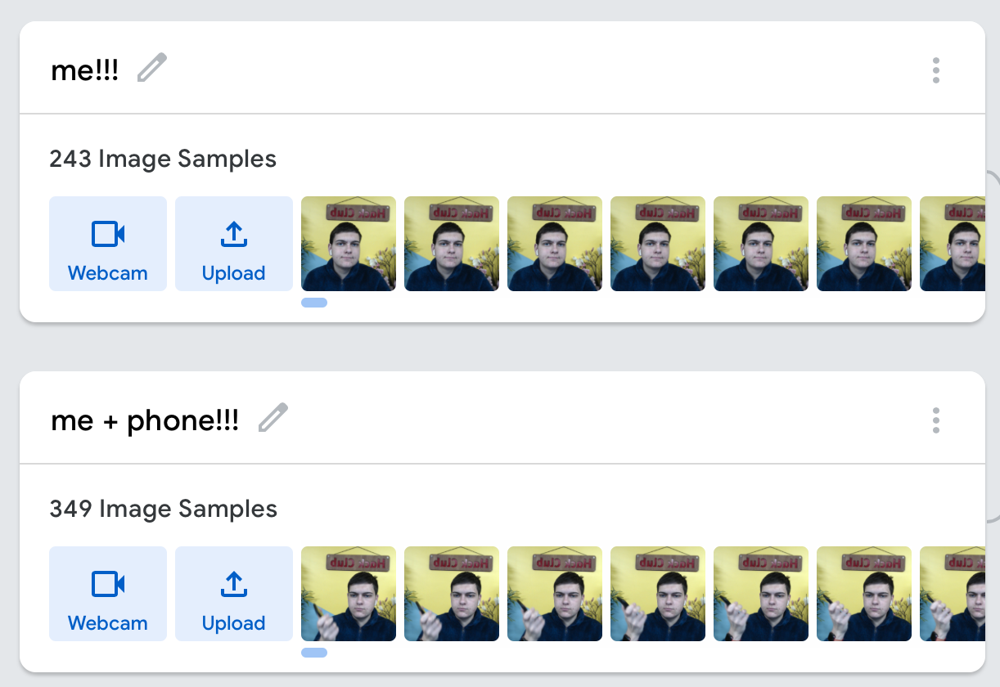
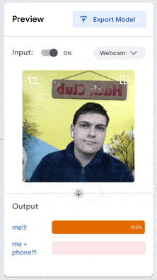
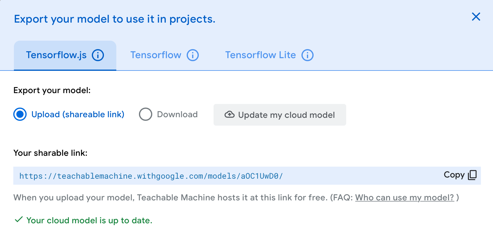
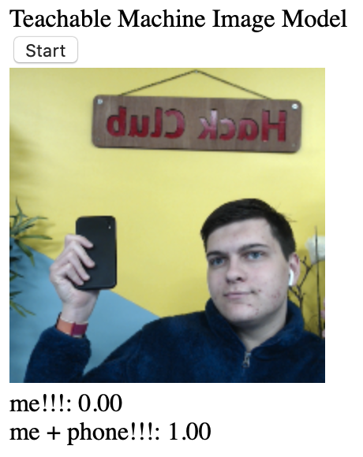
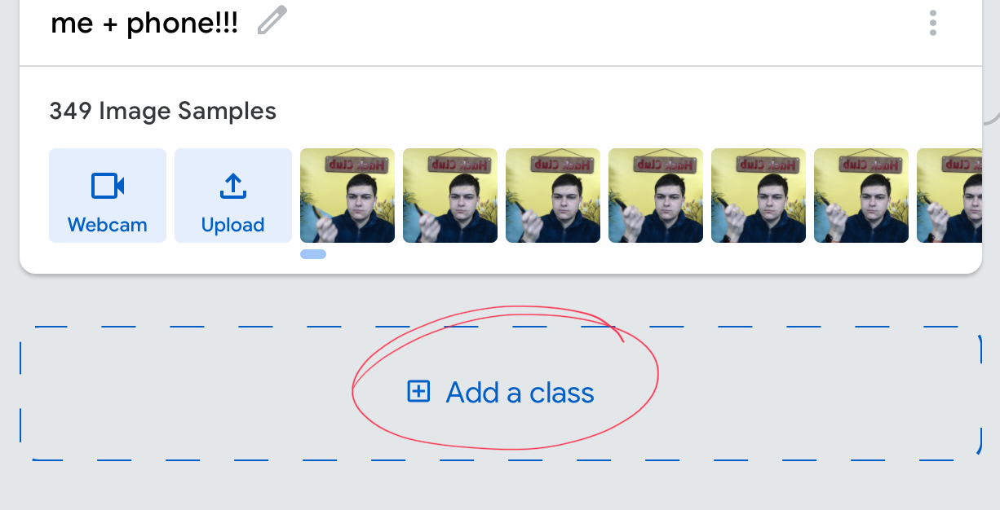

---

title: 'Teachable Machine'
description: 'Começe com machine learning sem precisar programar'  
bg-image: "/workshops/teachable-machine/img/teachable.png"
permalink: /workshops/teachable-machine/
order: 2

---

Começe com machine learning sem precisar programar
  

Feito por <a href="https://github.com/MatthewStanciu" target="_blank">@MatthewStanciu</a>

Traduzido por <a href="https://github.com/vitorvavolizza" target="_blank">@vitorvavolizza</a>

 

O [Teachable Machine](https://teachablemachine.withgoogle.com) é um site feito pelo Google que permite a criação rápida de modelos de aprendizado de máquina sem programação. É uma maneira fantástica de aprender os conceitos fundamentais do aprendizado de máquina e ser capaz de aplicá-los a projetos interessantes sem ter que entender a matemática complexa normalmente necessária para trabalhar com o aprendizado de máquina. Neste workshop, contruiremos um site super simples que detecta se sua câmera vê você sozinho ou com outro objeto (por exemplo, seu telefone).

## Como as máquinas aprendem?

Antes de prosseguirmos, algumas informações básicas rápidas:

Um modelo de aprendizado de máquina é um modelo matemático para o processo de aprendizado de máquina. Alguns exemplos de modelos de aprendizado de máquina incluem [redes neurais artificiais](https://pt.wikipedia.org/wiki/Rede_neural_artificial), [árvores de decisão](https://en.wikipedia.org/wiki/Decision_tree_learning) e [análise de regressão](https://en.wikipedia.org/wiki/Regression_analysis). Não se preocupe, você não precisa saber o que essas coisas realmente são - o Teachable Machine criará magicamente seu próprio modelo nos bastidores.

Os modelos de aprendizado de máquina são treinados com grandes quantidades de dados que tentam "ensinar" o modelo a resolver corretamente um problema específico (por exemplo, como um cachorro-quente se parece). Se você quiser saber mais sobre como os modelos de aprendizado de máquina são treinados, o canal CGP Gray fez [um vídeo fantástico](https://youtu.be/R9OHn5ZF4Uo) sobre isso.

## Treinando um modelo

Comece visitando [teachablemachine.withgoogle.com](https://teachablemachine.withgoogle.com) e clicando em “Get Started”. Você deve ver a opção de criar um projeto de imagem, áudio ou pose. Por enquanto, escolha “Image Project”.

Renomeie “Classe 1” e “Classe 2” para “eu” e “eu com [algum objeto]”.

Em seguida, ligue sua webcam para cada classe e clique em “Hold to Record” até que você tenha algumas centenas de amostras de imagens gravadas. Você deve tirar quantas fotos e capturar quantos ângulos, posições, etc. forem possível. Quanto mais dados você tiver, melhor seu modelo aprenderá a diferença entre os dois conjuntos de dados.

Depois de sentir que gravou amostras suficientes, clique em “Train Model”. O tempo que leva para treinar o modelo irá variar dependendo de quantas amostras de imagem você forneceu, mas geralmente leva cerca de 30 segundos.

Depois que seu modelo estiver treinado, uma visualização deve aparecer. Experimente! Se não estiver funcionando em alguns ângulos ou posições, volte e grave mais amostras com esses ângulos ou posições. Continue treinando seu modelo novamente até obter um modelo que identifique consistentemente a classe correta.

Esse é o meu modelo:

## Exportando seu modelo

A Teachable Machine hospedará seu modelo em seus servidores, para que você possa usá-lo em qualquer projeto que desejar. Para fazer o upload do seu modelo para os servidores do Teachable Machine, clique em “Export Model” e em “Upload my model” quando a janela aparecer. Após alguns segundos, você verá um link para seu modelo disponível em “Your sharable link:”

(Nota: se você estiver interessado em ver os dados brutos de seu modelo, copie o link para o modelo e cole-o na barra de URL com `model.json` no final)

## Fazendo um site

Agora é hora de adicionar seu modelo do Teachable Machine ao seu próprio projeto!

1. Role para baixo e copie o código que o Teachable Machine gerou para você
2. Crie um novo projeto HTML em [repl.it/languages/html](https://repl.it/languages/html)
3. Cole o código entre as tags `<body>`.

**Antes de executar**: certifique-se de ler o código que você acabou de colar! É totalmente comentado e super fácil de entender. É importante entender o que exatamente você está fazendo - caso contrário, você não aprendeu nada!

Execute o projeto e, em seguida, abra seu site em uma nova guia clicando no ícone no canto superior direito. Depois de clicar em “Start” e dar ao site acesso à sua webcam, você deverá ver o seu modelo!

## Hackeando

Parabéns! Você acabou de treinar um modelo de aprendizado de máquina diretamente no seu navegador, sem escrever nenhum código. Mas sua jornada está longe de terminar - há inúmeras maneiras de levar esse projeto adiante. Você percebeu o botão “Add a class” abaixo de suas duas classes originais?

Você pode treinar este modelo com quantas classes quiser! Experimente e veja até onde você pode chegar, você + telefone, você + garrafa de água, você + telefone + garrafa de água, etc. Vai fundo.

Além disso, o modelo mostrado em seu projeto é muito chato. Tente adicionar algum CSS a ele e torná-lo bonito!

Agora que você terminou de construir este maravilhoso projeto, compartilhe sua bela criação com outras pessoas! Lembre-se, é só mandar a URL do seu projeto!

Você provavelmente conhece as melhores maneiras de entrar em contato com seus amigos e familiares, mas se você quiser compartilhar seu projeto com a comunidade brasileira do Hack Club, não há melhor lugar para fazer isso do que no Discord do Hack Club Brasil.✨

1. Clique [aqui][discord]{:target="_blank"} para fazer parte da nossa comunidade!
2. Depois, poste o link do seu projeto no canal `💡┇criações` para compartilhá-lo com todos os Hack Clubbers!

A comunidade te espera!🎉🎉

[discord]: http://bit.ly/discord-hc-brasil